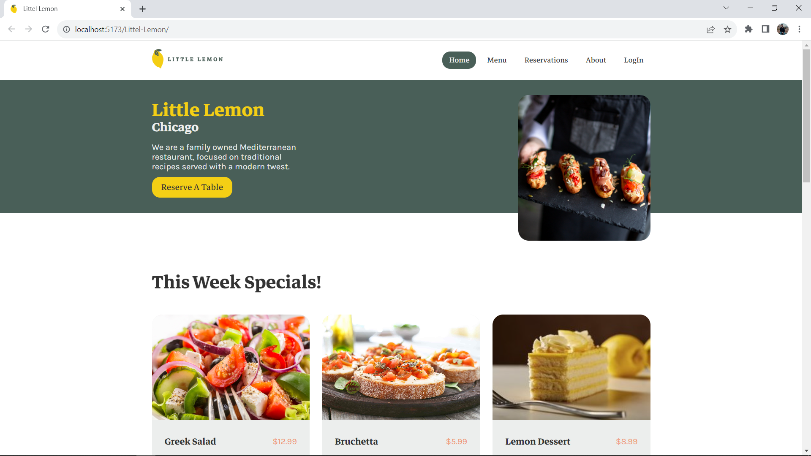

# Littel Lemon

This is a full website for a restaurant. Users can see what we offer, such as meals, desserts and drinks. They can book a table and confirm their reservation, and they can log in or out of the website.

### Screenshot

### Links

- Live Site URL: https://mohammad-shaar.github.io/Littel-Lemon/

## My process

### Built with

- Semantic HTML5 markup
- CSS Module
- React.js

### What I learned

In This project I applied all the skills and concepts I had learned so far, And it's include:

- How to use redux toolkit to manage the state of my website and write less code.
- How to use react-router to create dynamic routes and navigate between different pages of my website.
- How to use props to pass data and events between components
- How to use hooks to add state and effects to functional components.
- Hooks also allowed me to create my own custom hook, which was a fun and challenging experience.
- Finally, I built a professional-looking form with basic validation.
