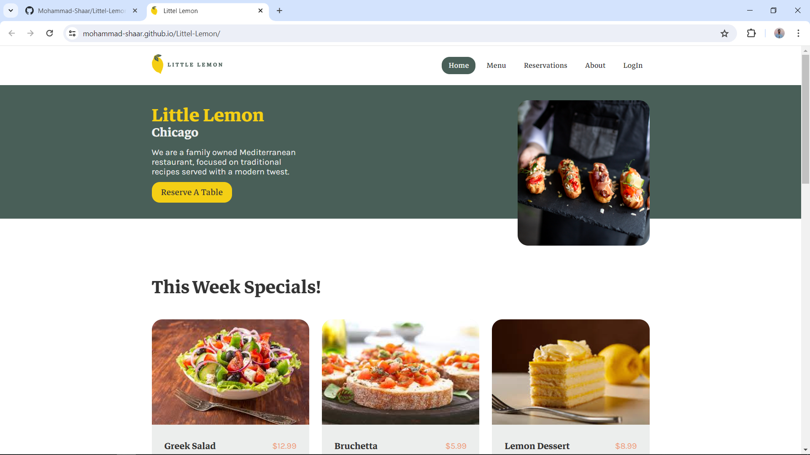

# Littel Lemon

This is a full MERN Stack website for a restaurant. Users can see what we offer, such as meals, desserts and drinks. They can book a table and confirm their reservation, they can orders online, and also they can log in or out of the website.

### Screenshot

### Links

- Live Site URL: https://mohammad-shaar.github.io/Littel-Lemon

## My process

### Built with

- Semantic HTML5 markup
- CSS Module
- React.js
- Express.js

### What I learned

In This project, I applied all the skills and concepts I had learned so far, it includes:

- How to use **Redux toolkit** to manage the state of my website and write less code.
- How to use **React-router** to create dynamic routes and navigate between different pages.
- How to use **props** to pass data and events between components
- How to use **hooks** to add state and effects to functional components.
- Hooks also allowed me to create my own **custom hook**, which was a fun and challenging experience.
- I also built professional-looking **Forms** with basic validation for login and order confirmation.
- I used **json-server** to simulate a RESTful API using a JSON file as the data source.
- Then I built a basic back-end with **Express.js**, and I used **MongoDB** as my database.
- Finally, I deployed my back-end on **Render** and my front-end on **GitHub pages**.
